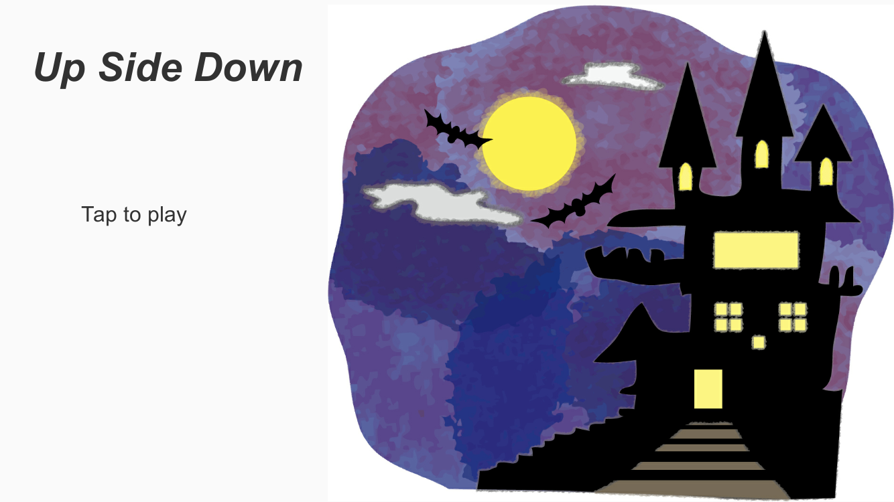
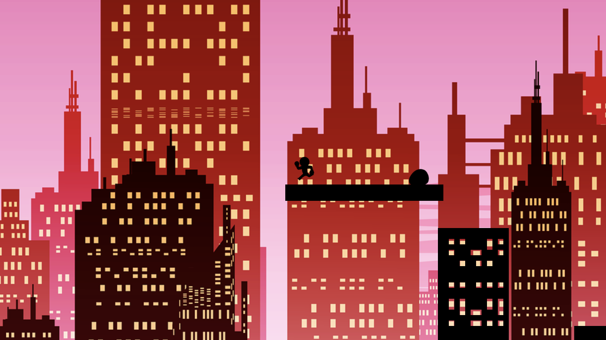

# Upsidedown-Demo
Upsidedownは裏の世界、影の世界をテーマとしたゲームです。

現在オープンソースで公開しています。

## ゲームについて
このゲームは初めてプレイする人でも、ガイド、チュートリアルを見ずに
感覚でプレイできるようシンプルなゲームシステムにしました。
また、世界観を感じて頂けるよう黒を基調としたデザイン、
神秘的なBGMをチョイスしました。

| 起動時画面 |
|:-:|
|  |

## プレイ方法
このゲームはスマートフォン、タブレットを利用してプレイします。
| プレイ画面 |
|:-:|
|  |

操作にジャイロセンサーを採用し、端末を傾けることでプレイヤーを動かし
タップでジャンプするシンプルな横スクロールアクションゲームになっています。
ゴールであるゴーストにタッチするとクリア！
敵であるスライムを避けてゴールを目指しましょう！
| プレイ画面 |
|:-:|
|  |

スライムと衝突または足場から落ちてしまうとプレイヤーは死亡し
スタート位置にリスポーンされます。
| プレイ画面 |
|:-:|
|  スライムに衝突
  |
|  足場から落ちる
  |

## インストール方法
現在、アプリの配信は行っていません。

## 開発環境
* ゲームエンジン：Unity(2018.4.15f)
* アセット
  * Platformer Microgame
  * Deep In Space
